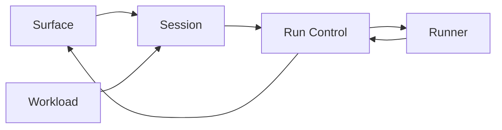
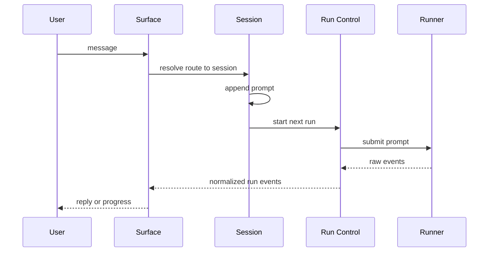
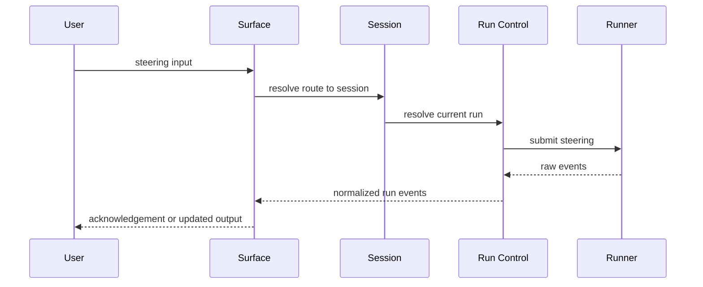

[English](../../../../architecture/v0.2/03-component-flows-and-validation-loops.md) | [Tiếng Việt](./03-component-flows-and-validation-loops.md)

# Luồng giữa các thành phần và các vòng xác minh

Source of truth:

- [docs/overview/human-requirements.md](../../overview/human-requirements.md)
- [docs/architecture/v0.2/final-layered-architecture.md](./final-layered-architecture.md)

Câu hỏi file này trả lời là:

Các layer nói chuyện với nhau thế nào mà không làm rò ownership?

## Hình dạng giao tiếp ổn định

## Quy tắc boundary

1. `Surface` resolve route và render output, nhưng không quyết định session continuity hay run state.
2. `Session` resolve conversation continuity và queue order, nhưng không nói raw runner protocol.
3. `Run Control` start, steer, và settle active run, nhưng không rewrite route hay session identity.
4. `Runner` mở session, submit input, và phát raw facts, nhưng không quyết định queue hay loop policy.
5. `Workload` lên lịch fresh work, nhưng execution thật sự phải quay lại qua `Session`.

## Các luồng chính

| Flow | Đường đi | Lý do chính |
| --- | --- | --- |
| Normal message | `Surface -> Session -> Run Control -> Runner -> Run Control -> Surface` | route, conversation, run, và executor được giữ tách nhau |
| Steering | `Surface -> Session -> Run Control -> Runner -> Run Control -> Surface` | steering là active-run behavior, không phải route behavior |
| Session queue | `Session -> Run Control -> Runner -> Run Control -> Session` | session prompt phải chạy tuần tự |
| New conversation | `Surface -> Session` | cùng `sessionKey`, nhưng có thể có `sessionId` active mới |
| Session loop | `SessionLoop -> Session -> Run Control` | repeated work gắn với session vẫn thuộc session |
| Global loop | `GlobalLoop -> Workload -> Session -> Run Control` | repeated work mức global không thuộc session |
| Backlog item | `Backlog -> Workload -> Session -> Run Control -> Runner` | fresh-session work phải ở ngoài active conversation cho tới khi được admit |

## Các sequence diagram cốt lõi

### Normal message

Các điểm cần giữ:

- `Surface` không quyết định continuity
- `Session` không nói runner protocol
- `Run Control` không tự render

### Steering

Các điểm cần giữ:

- steering thuộc về run
- queue bypass chỉ được đi qua `Run Control`

## Ghi chú ngắn cho từng flow

| Flow | Truth bắt buộc phải giữ |
| --- | --- |
| Session queue | `SessionQueue` là session workflow, không phải surface queue và cũng không phải queue nội bộ của tool |
| New conversation | `sessionKey` ổn định, `sessionId` active có thể xoay, và liên kết lịch sử vẫn có thể giữ |
| Session loop | queue mode là mặc định; direct steering từ loop phải là thứ explicit |
| Global loop | admission pressure nằm trong `Workload` |
| Backlog item | không được nhảy thẳng vào `Runner` |

## Bao phủ raw requirements

| Requirement | Bao phủ bởi | Kết quả |
| --- | --- | --- |
| Liên kết giữa session và `sessionId` | normal message, new conversation | `sessionKey` ổn định, `sessionId` có thể xoay |
| Chat surface khác với session | normal message, steering, new conversation | route và conversation được giữ tách riêng |
| Runner là executor abstraction | normal message, steering, global loop, backlog | tmux bây giờ, API hoặc SDK về sau |
| Chỉ sinh thêm coordination object khi có lý do | session loop, global loop, backlog | chỉ giữ lại `SessionQueue`, `SessionLoop`, `GlobalLoop`, `RunnerPool` |
| Run state machine | normal message, steering | run transition nằm trong `Run Control` |
| Session queue là sequential workflow | session queue | chạy từng cái một |
| Steering là direct injection | steering | đường bypass này explicit và do run sở hữu |
| Backlog nằm ngoài một session | backlog | fresh-session work có chỗ ở riêng |
| Session-bound loop khác global loop | session loop, global loop | ownership rõ ràng |
| Runner pool cap concurrency | global loop, backlog | admission diễn ra trước execution mới |

## Review loop

Mỗi vòng thiết kế nên lặp lại các câu hỏi sau:

1. Đây là route truth, conversation truth, run truth, runner truth, hay scheduling truth?
2. Đường này có thể bỏ qua một layer mà vẫn truthful không?
3. Đây là công việc gắn session hay fresh work?
4. Nếu cùng một danh từ xuất hiện ở hai layer, layer nào nên bỏ nó đi?
