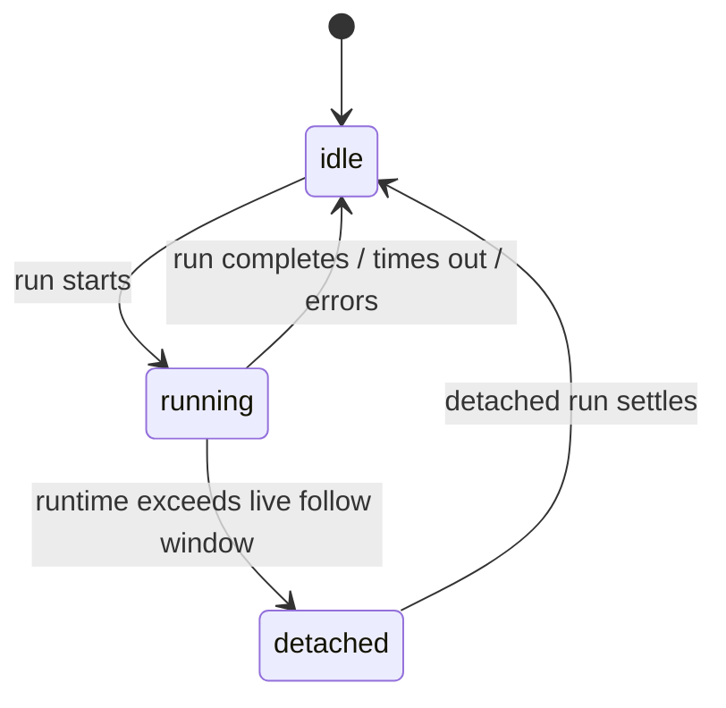
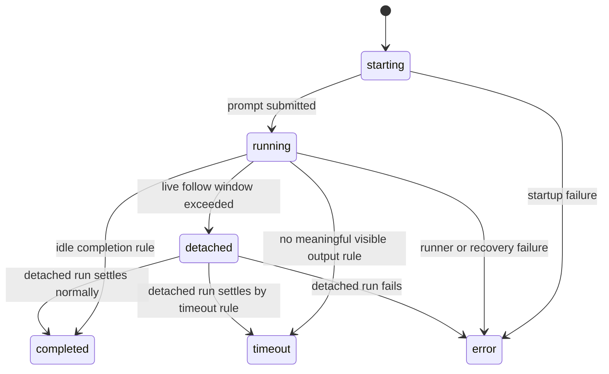

[English](../../../../architecture/v0.2/06-state-machines.md) | [Tiếng Việt](./06-state-machines.md)

# State machines

Source of truth:

- [docs/overview/human-requirements.md](../../overview/human-requirements.md)
- [docs/architecture/v0.2/final-layered-architecture.md](./final-layered-architecture.md)
- [docs/architecture/v0.2/04-layer-function-contracts.md](./04-layer-function-contracts.md)

File này tồn tại để làm state model trở nên MECE.

Quy tắc chính:

không dùng một giant enum để ôm cùng lúc queue state, session runtime state, và active run state.

## 1. Các state family canonical

Có ba state family tách biệt.

| State family | Owner | Mục đích |
| --- | --- | --- |
| `SessionQueueState` | `Session` | prompt có còn đang đợi theo session order hay không |
| `SessionRuntimeState` | `Session` | session hiện có active runtime projection hay không |
| `RunState` | `Run Control` | active run hiện đang ở trạng thái nào |

## 2. SessionQueueState

Canonical state:

- `queued`

Ý nghĩa:

- prompt đang tồn tại trong `SessionQueue`
- nó chưa trở thành active run

Exit:

- một khi `Run Control` claim nó, nó rời queue state để sang run state

Quy tắc:

- `queued` không phải `RunState`
- chỉ riêng `queued` không làm đổi `SessionRuntimeState`

## 3. SessionRuntimeState

Canonical states:

- `idle`
- `running`
- `detached`

Định nghĩa:

| State | Nghĩa |
| --- | --- |
| `idle` | hiện không còn active run nào được projection cho session này |
| `running` | session có active run và clisbot vẫn đang ở live follow mode |
| `detached` | session vẫn có active run, nhưng clisbot đã rời live follow mode và sẽ chỉ settle sau |

State machine:

Quy tắc:

- `detached` vẫn là active, không phải terminal
- `detached` không có nghĩa là paused
- `idle` nghĩa là không còn active runtime projection
- `SessionRuntimeState` là persisted projection, không phải source of truth cho live run

Quy tắc projection:

| Underlying active run view | SessionRuntimeState |
| --- | --- |
| không có active run | `idle` |
| `RunState = starting` hoặc `running` | `running` |
| `RunState = detached` | `detached` |
| terminal outcome đã được ghi và run đã đóng | `idle` |

Quy tắc liveness:

- một in-memory active run do `SessionService` sở hữu là monitor-owned; chỉ run monitor mới được chuyển runner loss thành recovery, terminal failure, hoặc idle
- một persisted `running` hoặc `detached` runtime mà không có in-memory active run phải được check lại với runner backend trước khi nó được phép chặn công việc mới
- nếu projection đã persist đó trỏ tới một tmux session đã mất, hãy clear nó về `idle` rồi để prompt tiếp theo đi theo startup/resume path bình thường
- không dùng tmux liveness check trong admission path để xóa một in-memory active run, vì như vậy có thể bypass mid-run recovery

## 4. RunState

Canonical states:

- `starting`
- `running`
- `detached`
- `completed`
- `timeout`
- `error`

Định nghĩa:

| State | Nghĩa |
| --- | --- |
| `starting` | run đã tồn tại nhưng runner bootstrap hoặc prompt submission vẫn chưa được xác nhận |
| `running` | prompt submission đã được xác nhận và run đang thật sự thực thi |
| `detached` | run vẫn đang thực thi nhưng live follow đã bị rời đi |
| `completed` | execution kết thúc bình thường |
| `timeout` | execution không tạo ra meaningful visible output trong giới hạn timeout đã cấu hình |
| `error` | execution kết thúc vì bootstrap, runner, hoặc recovery fail |

State machine:

Category:

| Category | States |
| --- | --- |
| active run states | `starting`, `running`, `detached` |
| terminal run states | `completed`, `timeout`, `error` |

Quy tắc:

- `settled` là category, không phải literal state value
- `queued` nằm ngoài state family này
- `detached` là active, không phải terminal

Tập transition tối thiểu:

- `starting -> running`
- `starting -> error`
- `running -> detached`
- `running -> completed | timeout | error`
- `detached -> completed | timeout | error`

## 5. Xác minh với code hiện tại

Code hiện tại đã có phần lớn sự tách bạch này:

| Vị trí trong code hiện tại | State family tương ứng |
| --- | --- |
| `src/agents/run-observation.ts` | `SessionRuntimeState = idle | running | detached` |
| `src/agents/run-observation.ts` | `PromptExecutionStatus = running | completed | timeout | detached | error` |
| `src/shared/transcript-rendering.ts` | surface rendering thêm `queued` cho queue-facing message |

Điểm mismatch hiện tại đáng gọi tên:

- implementation hiện vẫn gộp `starting` vào `running` cộng với note text kiểu `Starting runner session...`
- implementation hiện lộ `PromptExecutionStatus`, chưa lộ đầy đủ canonical split giữa queue state, runtime projection state, và active run state

Hướng khuyến nghị:

- vẫn giữ `starting` là một architecture state riêng, kể cả khi code hiện tại còn render nó thông qua `running + note`
- nếu về sau code được chuẩn hóa lại, hãy tách state này explicit thay vì tiếp tục giấu startup trong note text

## 6. Checklist review

Khi review code hoặc docs:

1. `queued` có đang bị đối xử như active run state hay không?
2. `detached` có đang bị đối xử như terminal dù thực ra vẫn active hay không?
3. `settled` có đang bị dùng như literal persisted state thay vì category hay không?
4. `starting` có đang bị giấu trong generic `running` behavior hay không?
5. Session-runtime states có đang bị trộn với run states hay không?

Nếu có, state model đang bị rò.
